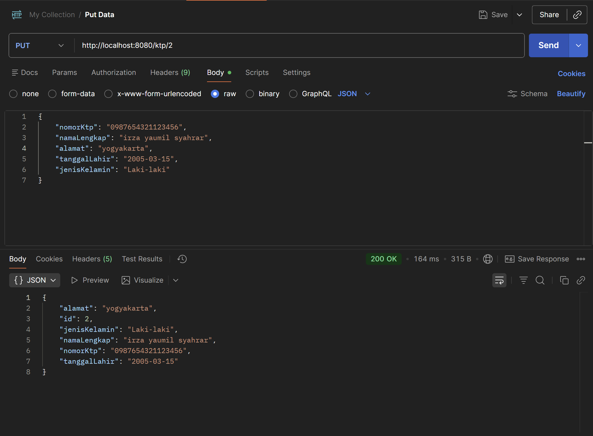
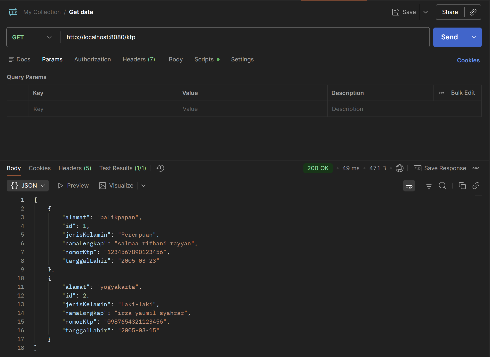
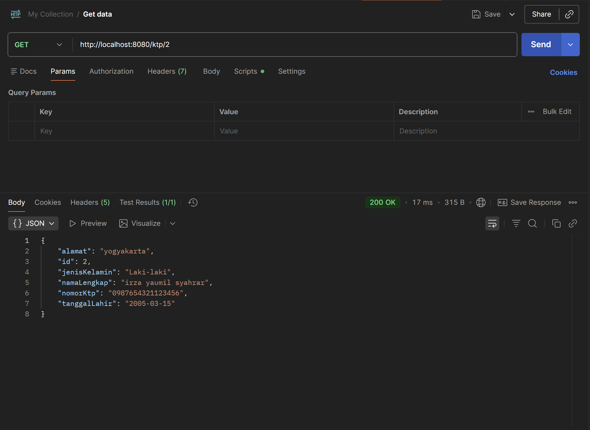
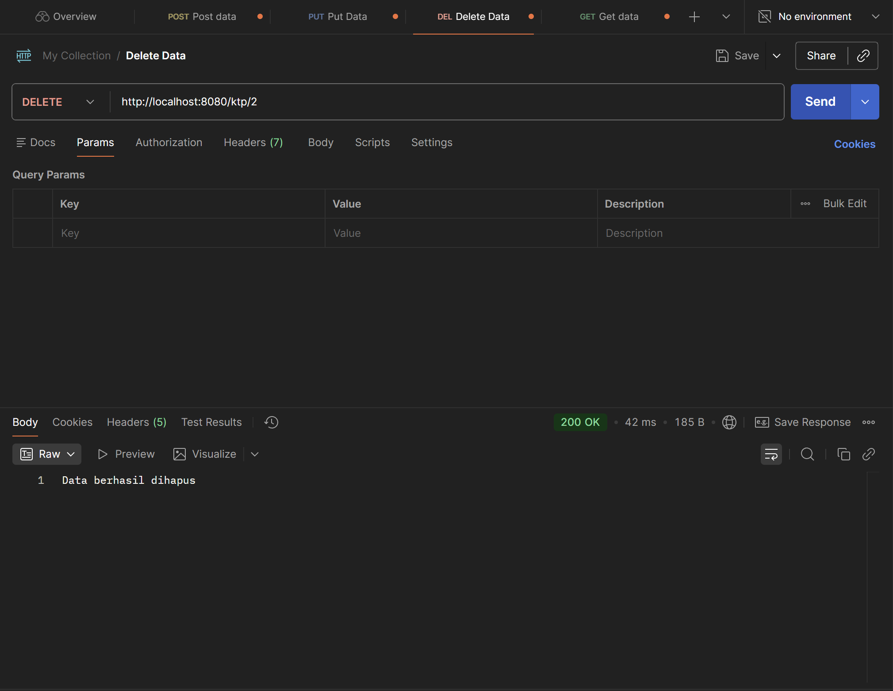
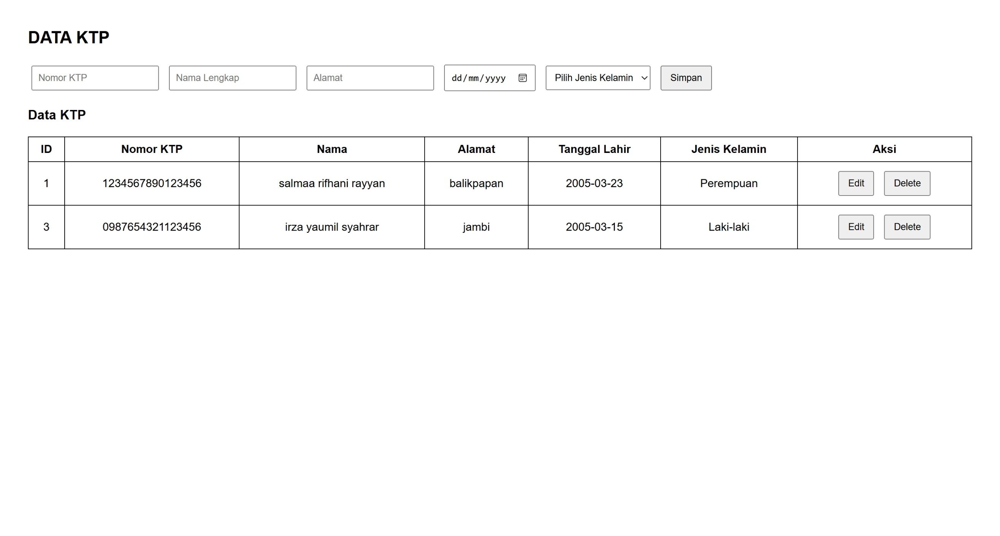

# KTP API Specification

## Create KTP
Endpoint : POST /ktp

Request Body :

```json
{
  "nomorKtp": "1234567890123456",
  "namaLengkap": "Salmaa Rifhani Rayyan",
  "alamat": "Balikpapan",
  "tanggalLahir": "2005-03-23",
  "jenisKelamin": "Perempuan"
}
```

Response Body (success) :

```json
{
  "data": {
    "id": 1,
    "nomorKtp": "1234567890123456",
    "namaLengkap": "Salmaa Rifhani Rayyan",
    "alamat": "Balikpapan",
    "tanggalLahir": "2005-03-23",
    "jenisKelamin": "Perempuan"
  }
}
```

Response Body (failed) :

```json
{
  "error": "Invalid input data"
}
```
Screenshot hasil endpoint POST


## Update KTP
Endpoint : PUT /ktp/{id}

Request Body :

```json
{
  "nomorKtp": "1234567890123456",
  "namaLengkap": "Salmaa Rifhani Rayyan",
  "alamat": "Yogyakarta",
  "tanggalLahir": "2005-03-23",
  "jenisKelamin": "Perempuan"
}
```

Response Body (success) :

```json
{
  "data": {
    "id": 1,
    "nomorKtp": "1234567890123456",
    "namaLengkap": "Salmaa Rifhani Rayyan",
    "alamat": "Yogyakarta",
    "tanggalLahir": "2005-23-03",
    "jenisKelamin": "Perempuan"
  }
}
```

Response Body (failed) :

```json
{
  "error": "Data KTP not found"
}
```
Screenshot hasil endpoint PUT


## Get All KTP
Endpoint : GET /ktp

Response Body (success) :

```json
{
  "data": [
    {
      "id": 1,
      "nomorKtp": "1234567890123456",
      "namaLengkap": "Salmaa Rifhani Rayyan",
      "alamat": "Balikpapan",
      "tanggalLahir": "2005-03-23",
      "jenisKelamin": "Perempuan"
    }
  ]
}
```

Response Body (failed) :

```json
{
  "error": "Data not found"
}
```
Screenshot hasil endpoint GET all


## Get KTP by ID
Endpoint : GET /ktp/{id}

Response Body (success) :

```json
{
  "data": {
    "id": 1,
    "nomorKtp": "1234567890123456",
    "namaLengkap": "Salmaa Rifhani Rayyan",
    "alamat": "Balikpapan",
    "tanggalLahir": "2005-03-23",
    "jenisKelamin": "Perempuan"
  }
}
```

Response Body (failed) :

```json
{
  "error": "Data KTP not found"
}
```
Screenshot endpoint GET by Id


## Delete KTP
Endpoint : DELETE /ktp/{id}

Response Body (success) :

```json
{
  "message": "KTP deleted successfully"
}
```

Response Body (failed) :

```json
{
  "error": "Data KTP not found"
}
```
Screenshot endpoint DELETE


Dokumentasi Tampilan Web
